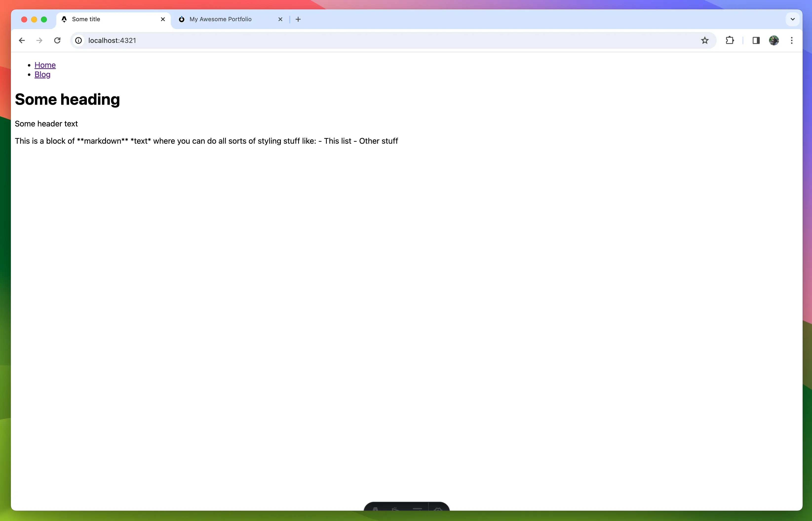
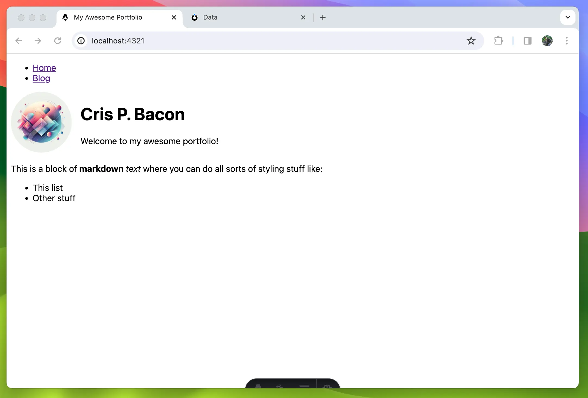

# Fetching data

Alright the moment we've been waiting for, getting the actual data into the app.

## Setup and creating a store

Data fetching and updating in Atomic is handled through a `Store`, the store manages connections to various atomic servers, authentication, real-time updates using web sockets, caching and more.
Most of the time, like in the case of this portfolio example, you share one global store that is shared throughout the application but if your app supports multiple users with their own data or account you will have to instantiate a store per each user as the store can only authenticate one agent at a time (This is by design to prevent leaking data between users).

Let's first create a `.env` file at the root of the project in which we specify some info like the URL of our Atomic server.
We also add an environment variable with the subject of our homepage resource.

The server URL is the subject of your Drive, you can find this by clicking on the name of the drive at the top and copying the URL in the address bar.

```env
// .env
ATOMIC_SERVER_URL=<REPLACE WITH URL TO YOUR ATOMIC SERVER>
ATOMIC_HOMEPAGE_SUBJECT=<REPLACE WITH SUBJECT OF THE HOMEPAGE RESOURCE>
```

Next, we'll create a folder called `helpers` and in it a file called `getStore.ts`.
This file will contain a function we can call anywhere in our app to get the global Store instance.

> **NOTE:** </br>
> If you don't like singletons and want to make a different system of passing the store around you can totally do that but for a simple portfolio website there is really no need

```typescript
// src/helpers/getStore.ts

import { Store } from '@tomic/lib';
import { initOntologies } from '../ontologies';

let store: Store;

export function getStore(): Store {
  if (!store) {
    // On first call, create a new store.
    store = new Store({
      serverUrl: import.meta.env.ATOMIC_SERVER_URL,
      // If your data is not public, you have to specify an agent secret here. (Don't forget to add AGENT_SECRET to the .env file)
      // agent: Agent.fromSecret(import.meta.env.AGENT_SECRET),
    });

    // @tomic/lib needs to know some stuff about your ontologies at runtime so we do that by calling the generated initOntologies function.
    initOntologies();
  }

  return store;
}
```

Now that we have a store we can start fetching data.

## Fetching

To fetch data we are going to use the `store.getResourceAsync()` method.
This is an async method on Store that takes a subject and returns a promise that resolves to a resource.
When `getResourceAsync` is called again with the same subject the store will return the cached version of the resource instead so don't worry about fetching the same resource again in multiple components.

`getResourceAsync` also accepts a type parameter, this type parameter is the subject of the resource's class.
You could type out the whole URL each time but luckily `@tomic/cli` generated shorthands for us.

Fetching our homepage will look something like this:

```typescript
import type { Homepage } from '../ontologies/myPortfolio';

const homepage = await store.getResourceAsync<Homepage>('<homepage subject>'); // Resource<Homepage>
```

## Reading data

Reading data from the resource can be done in a couple of ways.
If you've generated your ontology types and annotated the resource with a class you can use the props shortcut, e.g.

```typescript
...
const heading = homepage.props.heading; // string
```

This shortcut only works if the class is known to @tomic/lib, meaning if it's in one of your generated ontologies or one of the atomicdata.dev ontologies like [core](https://atomicdata.dev/ontology/core) or [server](https://atomicdata.dev/ontology/server).

The second method is using the `Resource.get()` method. `.get()` takes the subject of the property you want as a parameter and returns its value.

```typescript
const description = myResource.get(
  'https://atomicdata.dev/properties/description',
);

// @tomic/lib provides it's own ontologies for you to use urls like description
import { core } from '@tomic/lib';
const description = myResource.get(core.properties.description);
```

This method always works even if the class is not known beforehand.

> **NOTE:** </br>
> Using the `.get()` method is actually a tiny bit faster performance wise since we don't have to construct an object with reverse name to subject mapping on call. For normal use it really won't matter but if you have to read hundreds of props in a loop you should go for `.get()` instead of `.props`.

## Updating the homepage

Now that we know how to fetch data let's use it on the homepage to fetch the homepage resource and display the value of the `body-text` property.

In `src/pages/index.astro` change the content to the following:

```jsx
---
// src/pages/index.astro
import Layout from '../layouts/Layout.astro';
import { getStore } from '../helpers/getStore';
import type { Homepage } from '../ontologies/myPortfolio';

const store = getStore();

const homepage = await store.getResourceAsync<Homepage>(
	import.meta.env.ATOMIC_HOMEPAGE_SUBJECT,
);
---

<Layout>
	<p>{homepage.props.bodyText}</p>
</Layout>
```

Check your browser and you should see the body text has changed!



It's not rendered as markdown yet so let's quickly fix that by installing `marked` and updating our `index.astro`.

```
npm install marked
```

```jsx
---
// src/pages/index.astro
import { marked } from 'marked';
import Layout from '../layouts/Layout.astro';
import { getStore } from '../helpers/getStore';
import type { Homepage } from '../ontologies/myPortfolio';

const store = getStore();

const homepage = await store.getResourceAsync<Homepage>(
  import.meta.env.ATOMIC_HOMEPAGE_SUBJECT,
);

const bodyTextContent = marked.parse(homepage.props.bodyText);
---

<Layout>
  <p set:html={bodyTextContent}/>
</Layout>
```

Beautiful 👌


## Updating the header

To get our data into the header we are going to pass the resource through to the Layout component.
You might be hesitant to pass the whole resource instead of just the data it needs but don't worry, the Layout will stay generic and reusable.
We are going to change what we render based on the class of the resource we give it.
This approaches data-driven development territory, something Atomic Data is perfect for.
At first, this might all seem useless and that's because it is when we only have one page, but when we add blog posts in the mix later you'll see that this becomes a very powerful approach.

Let's start by making a `HomepageHeader` component.

In `src` create a folder called `components` and in there a file called `HomepageHeader.astro`

```jsx
---
// src/components/HomepageHeader.astro
import { Resource } from '@tomic/lib';
import type { Server } from '@tomic/lib';
import type { Homepage } from '../ontologies/myPortfolio';
import { getStore } from '../helpers/getStore';

interface Props {
  resource: Resource<Homepage>;
}

const store = getStore();
const { resource } = Astro.props;

const image = await store.getResourceAsync<Server.File>(
  resource.props.headerImage,
);
---

<header>
  <div class='wrapper'>
    
    <div>
      <h1>{resource.props.heading}</h1>
      <p>{resource.props.subheading}</p>
    </div>
  </div>
</header>

<style>
  img {
    height: 7rem;
    aspect-ratio: 1/1;
    clip-path: circle(50%);
  }

  .wrapper {
    display: flex;
    flex-direction: row;
    gap: 1rem;
  }
</style>
```

To display the header image we can't just use `resource.props.headerImage` directly in the src of the image element because the value is a reference to another resource, not the image link.
In most databases or CMSes, a reference would be some ID that you'd have to use in some type-specific endpoint or query language, not in Atomic.
A reference is just a subject, a URL that points to the resource.
If you wanted to you could open it in a browser or use the browser fetch API to get the resources JSON-AD and since it is a subject we can do the same we did to fetch the homepage, use `store.getResourceAsync()`.

Once we've fetched the image resource we can access the image URL through the `download-url` property e.g. `image.props.downloadUrl`.

Let's update the `Layout.astro` file to use our new header component

```jsx
---
// src/layouts/Layout.astro
import type { Resource } from '@tomic/lib';
import HomepageHeader from '../components/HomepageHeader.astro';

import { myPortfolio } from '../ontologies/myPortfolio';

interface Props {
  resource: Resource;
}

const { resource } = Astro.props;
---

<!doctype html>
<html lang='en'>
  <head>
    <meta charset='UTF-8' />
    <meta name='description' content='Astro description' />
    <meta name='viewport' content='width=device-width' />
    <link rel='icon' type='image/svg+xml' href='/favicon.svg' />
    <meta name='generator' content={Astro.generator} />
    <title>{resource.title}</title>
  </head>
  <body>
    <nav>
      <ul>
        <li>
          <a href='/'>Home</a>
        </li>
        <li>
          <a href='/blog'>Blog</a>
        </li>
      </ul>
    </nav>
    {
      resource.hasClasses(myPortfolio.classes.homepage) && (
        <HomepageHeader resource={resource} />
      )
    }
    <slot />
  </body>
</html>

<style is:global>
  body {
    font-family: system-ui;
  }
</style>
```

As you can see `<Layout />` now accepts a resource as prop.

We changed the `<title />` to use the name of the resource using `resource.title`, this is a shorthand for getting the resource's [name](https://atomicdata.dev/properties/name), [shortname](https://atomicdata.dev/properties/shortname) or [filename](https://atomicdata.dev/properties/filename) and falls back to the subject if it doesn't have any of the three properties.

Finally we've moved the `<nav />` out of the header and replaced the `<header />` with:

```jsx
resource.hasClasses(myPortfolio.classes.homepage) && (
  <HomepageHeader resource={resource} />
);
```

What we're doing here is only rendering a `<HomepageHeader />` component when the resource is a `homepage`.

`myPortfolio` is an object generated by `@tomic/cli` that contains a list of its classes and properties with their names mapped to their subjects.

Now all that's left to do is update `src/pages/index.astro` to pass the homepage resource to the `<Layout />` component.

```jsx
// src/pages/index.astro
...
<Layout resource={homepage}>
...
```

If all went according to plan you should now have something that looks like this:



Now of course a portfolio is nothing without projects to show off so let's add those.
