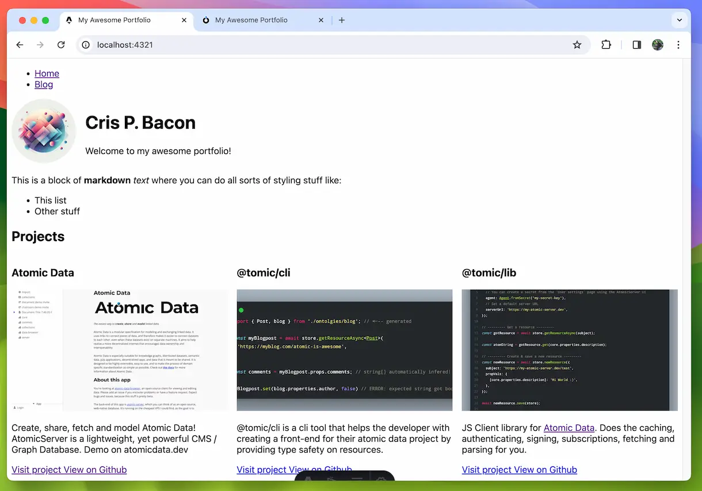

# Using ResourceArrays to show a list of projects

We are going to edit our portfolio ontology and give the homepage a list projects to display.

Go back to our ontology and add a **recommended** property to the `homepage` class called `projects`. Give it a nice description and set the datatype to `ResourceArray`. This is basically an array of subjects pointing to other resources. Click on the configure button next to datatype and in the classtype field type `project`, an option with the text `Create: project` should appear, click it and the new class will be added to the ontology.

<video controls>
  <source src="/videos/8-1.mp4">
</video>

We are going to give `project` 3 required and 2 recommended properties.

For the required add: [name](https://atomicdata.dev/properties/name) and [description](https://atomicdata.dev/properties/description)then create a property called `image` with datatype `RESOURCE` and a classtype of [file](https://atomicdata.dev/classes/File).

For the recommended properties create one called `demo-url` with datatype `STRING` and one called `repo-url` with the same type. `demo-url` will be used to point to a demo of the project (if there is one), `repo-url` will point to a git repository if there is one.

`project` should now look something like this:


Now in your data folder create some projects and add them to your homepage resource like I did here:


> **NOTE:** </br>
> To edit a resource press `Cmd + e` or `Ctrl + e`, alternatively you can click the context menu on the right of the search bar and click `Edit`

Since we changed the ontology we will have to generate our types again:

```
npx ad-generate ontologies
```

In your Astro code make a new Component in the `src/components` folder called `Project.astro`

```jsx
---
// src/components/Project.astro
import { marked } from 'marked';
import { getStore } from '../helpers/getStore';
import type { Project } from '../ontologies/myPortfolio';
import type { Server } from '@tomic/lib';

interface Props {
  subject: string;
}

const store = getStore();

const { subject } = Astro.props;
const project = await store.getResourceAsync<Project>(subject);
const coverImg = await store.getResourceAsync<Server.File>(project.props.image);

const description = marked.parse(project.props.description);
---

<div>
  <h3>
    {project.title}
  </h3>
  
  <div set:html={description} />
  <div>
    {
      project.props.demoUrl && (
        <a
          href={project.props.demoUrl}
          target='_blank'
          rel='noopener noreferrer'
        >
          Visit project
        </a>
      )
    }
    {
      project.props.repoUrl && (
        <a
          href={project.props.repoUrl}
          target='_blank'
          rel='noopener noreferrer'
        >
          View on Github
        </a>
      )
    }
  </div>
</div>

<style>
  img {
    width: 100%;
    aspect-ratio: 16 / 9;
    object-fit: cover;
  }
</style>

```

The component takes a subject as prop that we use to fetch the project resource using the `fetchResourceAsync` method.
We then fetch the image resource using the same method.

The description is markdown so we have to parse that first like we did on the homepage.

Finally the links. Because demoUrl and repoUrl are recommended properties and may therefore be undefined we use the short circuit `&&` operator here. This makes sure we don't render an empty link.

Lets update the homepage to use this Project component:

```jsx
---
// src/pages/index.astro
import { marked } from 'marked';
import Layout from '../layouts/Layout.astro';
import { getStore } from '../helpers/getStore';
import type { Homepage } from '../ontologies/myPortfolio';
import Project from '../components/Project.astro';

const store = getStore();

const homepage = await store.getResourceAsync<Homepage>(
  import.meta.env.ATOMIC_HOMEPAGE_SUBJECT,
);

const bodyTextContent = marked.parse(homepage.props.bodyText);
---

<Layout resource={homepage}>
  <p set:html={bodyTextContent} />
  <h2>Projects</h2>
  <div class='grid'>
    {homepage.props.projects?.map(subject => <Project subject={subject} />)}
  </div>
</Layout>

<style>
  .grid {
    display: grid;
    grid-template-columns: repeat(auto-fill, minmax(300px, 1fr));
    gap: 1rem;
  }
</style>
```

Since a ResourceArray is just an array of subjects we can map through them pass the subject over to the `<Project />` component.

Our homepage is now complete and looks like this:


