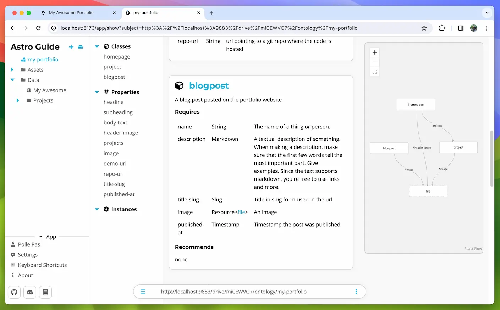
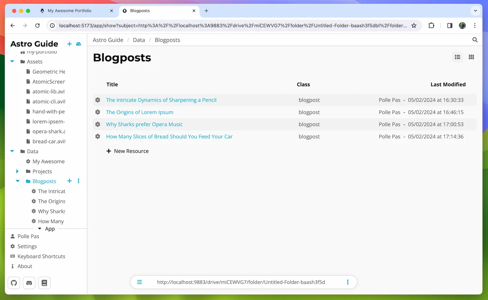
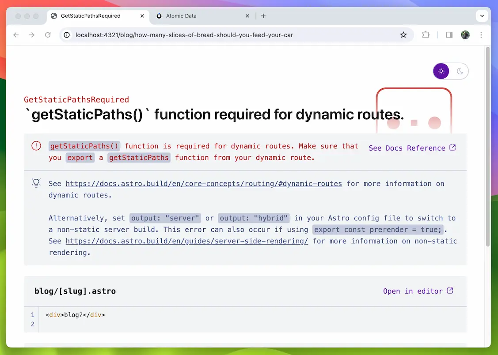
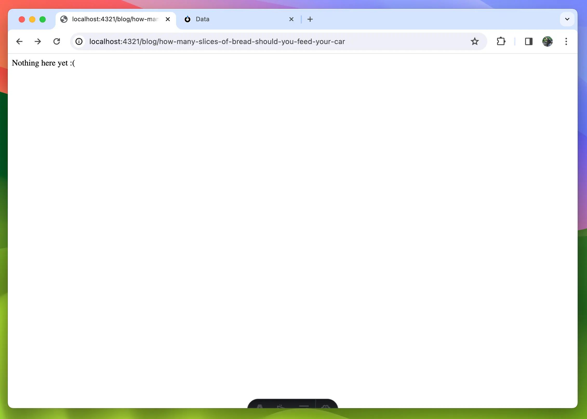
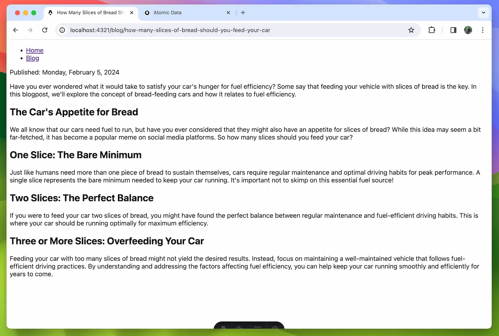

# Using Collections to build the blogs page

Most databases have a way to query data, in Atomic, this is done with Collections.
A collection is a dynamic resource created by AtomicServer based on the props we give it.
@tomic/lib makes it very easy to create them and iterate over them.

## Creating the model and data

Let's first add a `blogpost` class to our ontology.

Give it the following required properties:

- [name](https://atomicdata.dev/properties/name)- `https://atomicdata.dev/properties/name`
- [description](https://atomicdata.dev/properties/description) - `https://atomicdata.dev/properties/description`
- title-slug - datatype: `SLUG`
- image - (you can reuse the image property you created for `project`)
- published-at - datatype: `TIMESTAMP`

`name` is going to be used for the blog's title, `description` will be the content of the blog, `title-slug` is the title in slug form that is used in the URL, `image` is the cover image of the post and `published-at` will be the timestamp the post was published.



Regenerate the types by running:

```
npx ad-generate ontologies
```

Now create a folder called `Blogposts` inside your `Data` folder and add some blogposts to it.
I just made some nonsense articles as dummy content.



## Blog Cards

Our blog page will have a list of blog posts sorted from newest to oldest.
The blogs will be displayed as a card with their title and image.

We'll first make the blog card and then create the actual `/blog` route.

Create a component called `BlogCard.astro` inside the `src/components` folder.
This component looks and works a lot like the `<Project />` component.

```jsx
---
// src/components/BlogCard.astro
import type { Server } from '@tomic/lib';
import { getStore } from '../helpers/getStore';
import type { Blogpost } from '../ontologies/myPortfolio';

interface Props {
  subject: string;
}

const { subject } = Astro.props;
const store = getStore();

const blogpost = await store.getResourceAsync<Blogpost>(subject);
const cover = await store.getResourceAsync<Server.File>(blogpost.props.image);
---

<a href={`/blog/${blogpost.props.titleSlug}`}>
  
  <span>{blogpost.title}</span>
</a>

<style>
  img {
    width: 4rem;
    object-fit: cover;
    display: inline;
  }
</style>

```

Most of this code should be self-explanatory by now, the only point of interest is the anchor tag where we point to the blog's content page by using `titleSlug`.
These links won't work right away because we have yet to make these content pages.

Now to display a list of blogposts we are going to query Atomic Server using collections, so how do these collections work?

## Collections

A collection is made up of a few properties, most importantly: `property` and `value`.
The collection will collect all resources in the drive that have the specified property set to the specified value.

> **NOTE:** </br>
> You can also leave `property` or `value` empty meaning 'give me all resources with this property' or 'give me all resources with a property that has this value'

By setting `property` to `https://atomicdata.dev/properties/isA` (the subject of [is-a](https://atomicdata.dev/properties/isA)) and `value` to the subject of our blog post class we tell the collection to collect all resources in our drive that are of class: `blogpost`.

Additionally, we can also set these properties on a collection to refine our query

| Property                                                           | Description                                       | Datatype                                                       | Default |
| ------------------------------------------------------------------ | ------------------------------------------------- | -------------------------------------------------------------- | ------- |
| [sort-by](https://atomicdata.dev/properties/collection/sortBy)     | Sorts the collected members by the given property | Resource< [Property](https://atomicdata.dev/classes/Property)> | -       |
| [sort-desc](https://atomicdata.dev/properties/collection/sortDesc) | Sorts the collected members in descending order   | Boolean                                                        | false   |
| [page-size](https://atomicdata.dev/properties/collection/pageSize) | The maximum number of members per page            | Integer                                                        | 30      |

Creating a collection using `@tomic/lib` is done using the `CollectionBuilder` class to easily set all parameters and then calling `.build()` to finalise and return a `Collection`.

```typescript
const blogCollection = new CollectionBuilder(store)
  .setProperty(core.properties.isA)
  .setValue(myPortfolio.classes.blogpost)
  .setSortBy(myPortfolio.properties.publishedAt)
  .setSortDesc(true)
  .build();
```

Iterating over a collection can be done in a couple of ways.
If you just want an array of all members you can use:

```ts
const members = await collection.getAllMembers(); // string[]
```

If you want to loop over the members and do something with them collection provides an async iterator:

```ts
for await (const member of collection) {
  // do something with member
}
```

Finally, you can also ask the collection to return the member at a certain index, this is useful on the client when you want to let a child component handle the data fetching by passing the collection itself along with the index.

```ts
const member = await collection.getMemberWithIndex(10);
```

## Creating the blog's content page

Let's add the new blog list page to our website. Inside `src/pages` create a folder called `blog` and in there a file called `index.astro`.
This page will live on `https://<your domain>/blog`.
This will be a list of all our blog posts.

```jsx
---
// src/pages/blog/index.astro
import { CollectionBuilder, core } from '@tomic/lib';
import Layout from '../../layouts/Layout.astro';
import { getStore } from '../../helpers/getStore';
import { myPortfolio, type Homepage } from '../../ontologies/myPortfolio';
import BlogCard from '../../components/BlogCard.astro';

const store = getStore();

const homepage = await store.getResourceAsync<Homepage>(
  import.meta.env.ATOMIC_HOMEPAGE_SUBJECT,
);

const blogCollection = new CollectionBuilder(store)
  .setProperty(core.properties.isA)
  .setValue(myPortfolio.classes.blogpost)
  .setSortBy(myPortfolio.properties.publishedAt)
  .setSortDesc(true)
  .build();

const posts = await blogCollection.getAllMembers();
---

<Layout resource={homepage}>
  <h2>Blog</h2>
  <ul>
    {
      posts.map(post => (
        <li>
          <BlogCard subject={post} />
        </li>
      ))
    }
  </ul>
</Layout>
```

In this file, we create a collection using the CollectionBuilder.
We set `property` to `is-a` and value to `blogpost` to get a list of all blog posts in the drive.
We set `sort-by` to `published-at` so the list is sorted by publish date.
Then we set `sort-desc` to true so the list is sorted from newest to oldest.

We get an array of the post subjects using the `blogCollection.getAllMembers()`.
Then in the layout, we map over this array and render a `<BlogCard />` for each of the subjects.

Save and navigate to `localhost:4321/blog` and you should see the new blog page.


Clicking on the links brings you to a 404 page because we haven't actually made the blog content pages yet so let's do that now.

Our content pages will live on `https://<your domain>/blog/<title-slug>` so we need to use a route parameter to determine what blog post to show.
In Astro, this is done with square brackets in the file name.

Create a file in `src/pages/blog` called `[slug].astro`.
If you add some markup to the page and try to navigate to it you will get the following error:



This is because by default Astro generates all pages at build time (called: Static Site Generation) and since this is a dynamic route it needs to know what pages there will be during the build process.
This is fixed by exporting a `getStaticPaths` function that returns a list of all URLs the route can have.

The other downside of static site generation is that to see any changes made in your data the site needs to be rebuilt.
Most hosting providers like Netlify and Vercel make this very easy so this might not be a big problem for you but if you have a content team that is churning out multiple units of content a day rebuilding each time is not a viable solution.

Luckily Astro also supports Server side rendering (SSR).
This means that it will render the page on the server when a user navigates to it.
When SSR is enabled you won't have to tell Astro what pages to build and therefore the `getStaticPaths` function can be skipped.
Changes in the data will also reflect on your website without needing to rebuild.
This guide will continue to use Static Site Generation however but feel free to enable SSR if you want to, if you did you can skip the next section about `getStaticPaths`.
For more info on SSR and how to enable it check out [The Astro Docs](https://docs.astro.build/en/guides/server-side-rendering/).

### Generating routes with getStaticPaths()

For Astro to know what paths to generate we need to export a function called `getStaticPaths` that returns a list of params.

Change `src/pages/blog/[slug].astro` to the following:

```jsx
---
// src/pages/blog/[slug].astro
import type { GetStaticPaths, GetStaticPathsItem } from 'astro';
import { getStore } from '../../helpers/getStore';
import { CollectionBuilder } from '@tomic/lib';
import { core } from '@tomic/lib';
import { myPortfolio, type Blogpost } from '../../ontologies/myPortfolio';

export const getStaticPaths = (async () => {
  const store = getStore();
  // Build a collection of all blog posts on the drive
  const collection = new CollectionBuilder(store)
    .setProperty(core.properties.isA)
    .setValue(myPortfolio.classes.blogpost)
    .build();

  // Initialize the paths array
  const paths: GetStaticPathsItem[] = [];

  // Iterate over the collection and add the title-slug to the paths array
  for await (const subject of collection) {
    const post = await store.getResourceAsync<Blogpost>(subject);

    paths.push({
      params: {
        slug: post.props.titleSlug,
      },
      props: {
        subject,
      },
    });
  }

  return paths;
}) satisfies GetStaticPaths;

interface Props {
  subject: string;
}

const { subject } = Astro.props;
---

<div>Nothing here yet :(</div>

```

Here we define and export a `getStaticPaths` function.
In it, we create a collection of all blog posts in our drive.

We create an empty array that will house all possible params.

We then iterate over the collection, get the blog post from the store and push a new `GetStaticPathsItem` to the paths array.
In this item, we set the slug param to be the title-slug of the post and also add a `props` object with the subject of the post which we can access inside the component using `Astro.props`.

Then finally we return the paths array.

Now when you click on one of the blog posts on your blog page you should no longer get an error or a 404 page.



### Building the rest of the page

If you opted to use SSR and skipped the `getStaticPaths` function replace `const {subject} = Astro.props` with:

```ts
const { slug } = Astro.params;

// Build collection of all resources with a title-slug that matches the slug param
const postQuery = await new CollectionBuilder(store)
  .setProperty(myPortfolio.properties.titleSlug)
  .setValue(slug as string)
  .buildAndFetch();

// Get the first result of the collection
const subject = await postQuery.getMemberWithIndex(0);

// If the first result does not exist redirect to the 404 page.
if (!subject) {
  Astro.redirect('/404');
}
```

The rest of the page is not very complex, we use the subject passed down from the getStaticPaths function to fetch the blog post and use marked to parse the markdown content:

```jsx
---
// src/pages/blog/[slug].astro
import type { GetStaticPaths, GetStaticPathsItem } from 'astro';
import { getStore } from '../../helpers/getStore';
import { CollectionBuilder } from '@tomic/lib';
import { core } from '@tomic/lib';
import { myPortfolio, type Blogpost } from '../../ontologies/myPortfolio';
import Layout from '../../layouts/Layout.astro';
import { marked } from 'marked';
import FormattedDate from '../../components/FormattedDate.astro';

export const getStaticPaths = (async () => {
  const store = getStore();
  // Build a collection of all blogposts on the drive
  const collection = new CollectionBuilder(store)
    .setProperty(core.properties.isA)
    .setValue(myPortfolio.classes.blogpost)
    .build();

  // Initialize the paths array
  const paths: GetStaticPathsItem[] = [];

  // Iterate over the collection and add the title-slug to the paths array
  for await (const subject of collection) {
    const post = await store.getResourceAsync<Blogpost>(subject);

    paths.push({
      params: {
        slug: post.props.titleSlug,
      },
      props: {
        subject,
      },
    });
  }

  return paths;
}) satisfies GetStaticPaths;

interface Props {
  subject: string;
}

const store = getStore();

const { subject } = Astro.props;

const post = await store.getResourceAsync<Blogpost>(subject);

const content = marked.parse(post.props.description);
---

<Layout resource={post}>
  <article>
    Published: <FormattedDate timestamp={post.props.publishedAt} />
    <div set:html={content} />
  </article>
</Layout>
```

I've added a FormattedDate component here that formats a timestamp to something that is humanly readable

```jsx
---
// src/components/FormattedDate.astro
interface Props {
  timestamp: number;
}

const { timestamp } = Astro.props;

const date = new Date(timestamp);

const dateText = new Intl.DateTimeFormat('default', {
  dateStyle: 'full',
}).format(date);
---

<time datetime={date.toISOString()}>{dateText}</time>
```

The blog post page should now look something like this:



The only thing left is a Header with the image and title of the blog post.

Create a new component in the components folder called `BlogPostHeader.astro`

```jsx
---
// src/components/BlogPostHeader.astro
import type { Resource } from '@tomic/lib';
import type { Blogpost } from '../ontologies/myPortfolio';
import { getStore } from '../helpers/getStore';
import type { Server } from '@tomic/lib';

interface Props {
  resource: Resource<Blogpost>;
}

const { resource } = Astro.props;
const store = getStore();
const cover = await store.getResourceAsync<Server.File>(resource.props.image);
---

<header>
  <h1>
    {resource.title}
  </h1>
</header>

<style define:vars={{ imgURL: `url(${cover.props.downloadUrl})` }}>
  header {
    background-image: var(--imgURL);
    background-size: cover;
    height: 20rem;
    padding: 1rem;
  }
  h1 {
    color: white;
    text-shadow: 0 4px 10px rgba(0, 0, 0, 0.46);
  }
</style>
```

The component expects a blog post resource as a prop and then fetches the cover image resource.

We pass the image's `download-url` to the stylesheet using CSS Variables, in Astro this is done using [define\:vars](https://docs.astro.build/en/guides/styling/#css-variables).

Now update `src/layouts/Layout.astro` to render a `<BlogPostHeader />` when the resource has a blogpost class:

```jsx
---
// src/layouts/Layout.astro
import type { Resource } from '@tomic/lib';
import HomepageHeader from '../components/HomepageHeader.astro';
import BlogPostHeader from '../components/BlogPostHeader.astro';
import { myPortfolio } from '../ontologies/myPortfolio';


interface Props {
  resource: Resource;
}

const { resource } = Astro.props;
---

<!doctype html>
<html lang='en'>
  <head>
    <meta charset='UTF-8' />
    <meta name='description' content='Astro description' />
    <meta name='viewport' content='width=device-width' />
    <link rel='icon' type='image/svg+xml' href='/favicon.svg' />
    <meta name='generator' content={Astro.generator} />
    <title>{resource.title}</title>
  </head>
  <body>
    <nav>
      <ul>
        <li>
          <a href='/'>Home</a>
        </li>
        <li>
          <a href='/blog'>Blog</a>
        </li>
      </ul>
    </nav>
    {
      resource.hasClasses(myPortfolio.classes.homepage) && (
        <HomepageHeader resource={resource} />
      )
    }
    {
      resource.hasClasses(myPortfolio.classes.blogpost) && (
        <BlogPostHeader resource={resource} />
      )
    }
    <slot />
  </body>
</html>

<style is:global>
  body {
    font-family: system-ui;
  }
</style>
```

That should be it. Our blog post now has a beautiful header.


